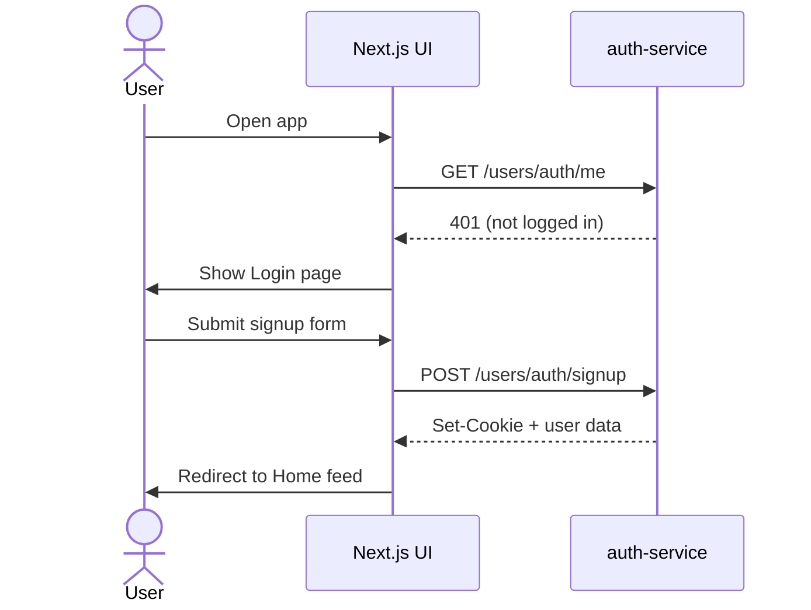
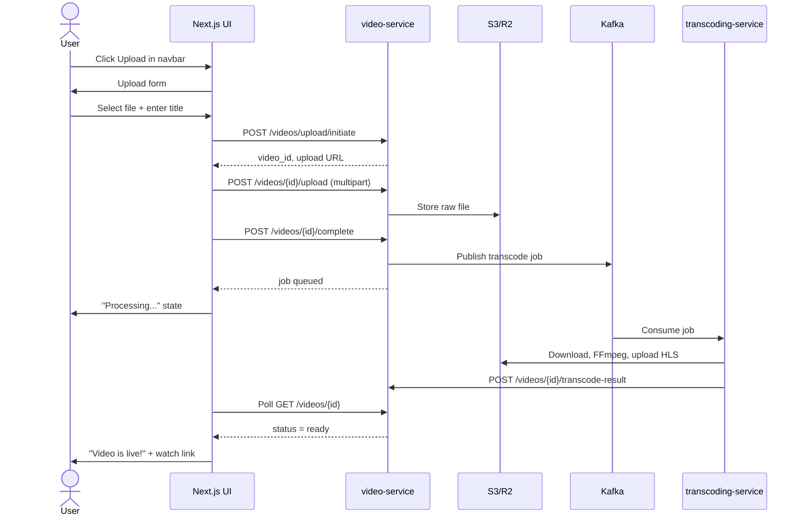
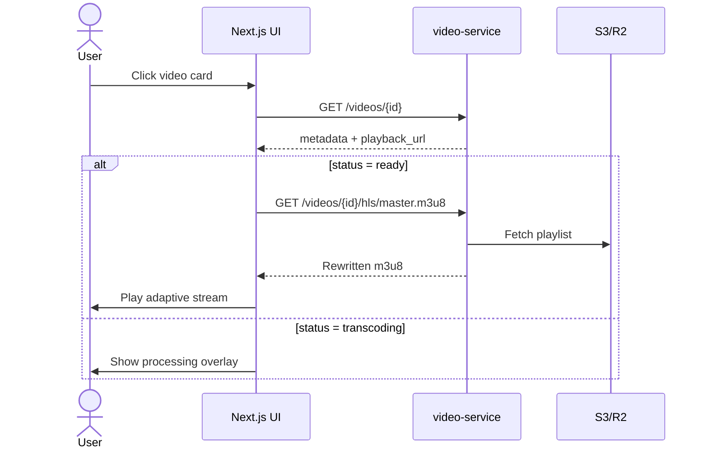
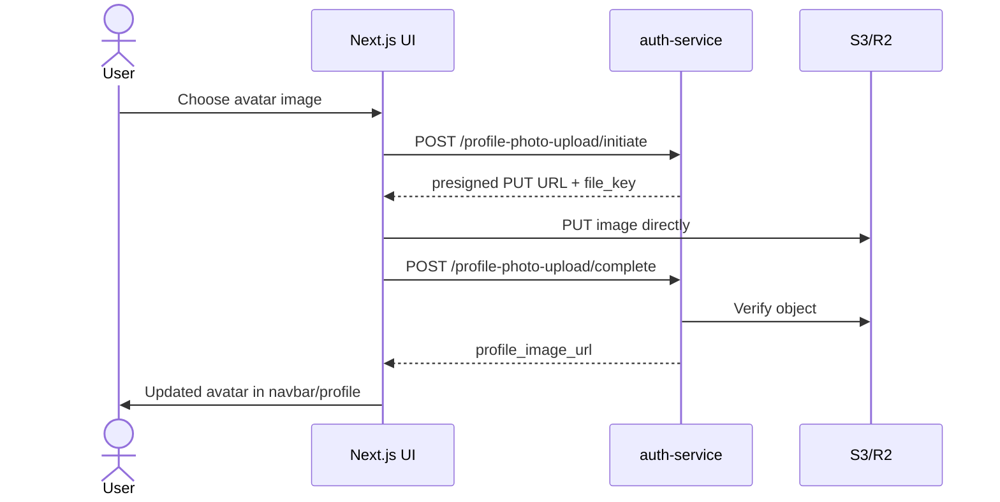

# Umtube — Video Streaming App Design Specification

> **Purpose:** This document describes the full product design, user flows, screen inventory, component system, and backend contracts for **Umtube**, a YouTube-style video streaming platform. It is intended for use with **Google Stitch** (and similar design-to-build tools) to generate and align UI with the existing microservices backend.

---

## 1. Product Overview

### 1.1 What is Umtube?

**Umtube** is a modern video streaming web application where users can:

- Register, log in (email/password or Google), and manage a profile with avatar
- Upload videos (MP4, WebM, MOV, MKV, MPEG)
- Watch videos with adaptive HLS streaming (1080p / 720p / 480p)
- Browse a home feed, trending content, subscriptions, history, liked videos, and watch-later lists
- Search for videos and creators

The product follows a **YouTube-inspired layout**: persistent left sidebar navigation, top search/action bar, and a scrollable content area.

### 1.2 Design Direction

| Attribute | Direction |
|-----------|-----------|
| **Visual style** | Glassmorphism — frosted glass panels over a soft gradient background |
| **Layout** | Desktop-first app shell (sidebar + top navbar + main content) |
| **Typography** | Geist Sans (primary), Geist Mono (code/metadata) |
| **Iconography** | Lucide React icons (outline style, 18–20px) |
| **Interaction** | Subtle hover states, smooth transitions, sticky navbar |

### 1.3 Current Implementation Status

| Layer | Status |
|-------|--------|
| **Backend (auth + video + transcoding)** | Largely implemented |
| **API Gateway (nginx)** | Partial — routing needs alignment |
| **Next.js frontend shell** | Layout components exist; pages are stubs |
| **Legacy HTML tools** | Working upload + player prototypes in `video-service/frontend/` |

Stitch should design the **full Next.js experience** described below, wired to the existing backend APIs.

---

## 2. System Architecture (Context for Designers & Builders)

```
┌─────────────────────────────────────────────────────────────────┐
│                     Browser (Next.js :3000)                      │
│  ┌──────────┬──────────────────────────────────────────────────┐ │
│  │ Sidebar  │  Navbar (search, upload, notifications, profile) │ │
│  ├──────────┼──────────────────────────────────────────────────┤ │
│  │          │  Main Content (feed, watch, upload, settings)  │ │
│  └──────────┴──────────────────────────────────────────────────┘ │
└────────────────────────────┬────────────────────────────────────┘
                             │ HTTPS / cookies
                             ▼
┌─────────────────────────────────────────────────────────────────┐
│                   API Gateway (nginx :8090)                      │
│   /users/*  →  auth-service (:8000)                              │
│   /videos/* →  video-service (:8001)                             │
└────────────┬───────────────────────────────┬────────────────────┘
             ▼                               ▼
┌────────────────────────┐    ┌──────────────────────────────────┐
│   auth-service         │    │   video-service                   │
│   PostgreSQL           │    │   SQLite / PostgreSQL             │
│   JWT HttpOnly cookies │    │   S3 presigned uploads            │
│   Profile photos → S3  │    │   HLS playback proxy              │
└────────────────────────┘    └──────────────┬───────────────────┘
                                             │ Kafka
                                             ▼
                              ┌──────────────────────────────────┐
                              │   transcoding-service (worker)    │
                              │   FFmpeg → multi-res HLS → S3     │
                              └──────────────────────────────────┘
```

### 2.1 External Services

- **Object storage:** AWS S3 or Cloudflare R2 (videos, avatars, HLS segments)
- **Message queue:** Apache Kafka (`video-transcode-jobs` topic)
- **Transcoding:** FFmpeg worker (1080p, 720p, 480p HLS variants)

---

## 3. Design System

### 3.1 Color & Surface Tokens

| Token | Value | Usage |
|-------|-------|-------|
| `surface-glass` | `bg-white/60 backdrop-blur-xl` | Sidebar, navbar, cards |
| `border-glass` | `border-white/30` | Panel edges |
| `hover-glass` | `hover:bg-white/10` | Buttons, nav items |
| `shadow-elevated` | `shadow-lg` | Cards, modals |
| `text-primary` | Near-black / white (theme-dependent) | Headings, labels |
| `text-muted` | Gray 500–600 | Metadata, timestamps |

**Background:** Soft gradient or blurred image behind glass panels (not yet defined in code — recommend a subtle blue-purple gradient for Stitch mockups).

### 3.2 Typography

| Element | Style |
|---------|-------|
| App title (sidebar) | `text-2xl font-bold` — "Umtube" |
| Page heading | `text-xl font-semibold` |
| Video title | `text-base font-medium` |
| Metadata (views, date) | `text-sm text-muted` |
| Body | Geist Sans, default 16px |

### 3.3 Spacing & Layout Grid

| Element | Size |
|---------|------|
| Sidebar width | `w-72` (288px) |
| Navbar height | `h-20` (80px) |
| Main content padding | `p-6` (24px) |
| Card border radius | `rounded-lg` |
| Nav item padding | `p-2`, gap `gap-3` |

### 3.4 Core UI Component: GlassCard

Reusable frosted container for video cards, forms, and settings panels.

```
┌─────────────────────────────────┐
│  bg-white/60 backdrop-blur-xl   │
│  border border-white/30           │
│  rounded-lg p-6 shadow-lg       │
│                                 │
│  { children }                   │
└─────────────────────────────────┘
```

**File:** `frontend/src/components/ui/glasscard.js`

### 3.5 Icon Set (Lucide)

| Screen area | Icons |
|-------------|-------|
| Sidebar | Home, Flame, PlaySquare, History, Heart, ListVideo, Settings, User |
| Navbar | Search, Bell, Upload |
| Player | Play, Pause, Volume, Settings (quality) |
| Auth | Mail, Lock, Google (brand) |

---

## 4. App Shell (Global Layout)

Every authenticated page uses the same shell.

```
┌────────────┬──────────────────────────────────────────────────────┐
│            │  [🔍 Search........................]  [🔔] [Upload]  │  ← sticky navbar
│  Umtube    ├──────────────────────────────────────────────────────┤
│            │                                                      │
│  🏠 Home   │                                                      │
│  🔥 Trending│              PAGE CONTENT                           │
│  ▶ Subs    │              (scrollable)                            │
│  🕐 History│                                                      │
│  ❤ Liked   │                                                      │
│  📋 Later  │                                                      │
│            │                                                      │
│  ⚙ Settings│                                                      │
│  👤 Profile│                                                      │
└────────────┴──────────────────────────────────────────────────────┘
     288px                        flex-1
```

### 4.1 Sidebar (`sidebar.js`)

- **Brand:** "Umtube" logo/title at top
- **Primary nav (vertical list of buttons):**
  - Home
  - Trending
  - Subscriptions
  - History
  - Liked Videos
  - Watch Later
- **Secondary nav (bottom or below divider):**
  - Settings
  - Profile / Account
- **Active state:** Highlighted background on current route
- **Style:** `w-72`, glass surface, right border

### 4.2 Navbar (`navbar.js`)

- **Left/center:** Search bar with magnifying glass icon
- **Right actions:**
  - Notifications bell (badge for unread count)
  - Upload button (icon + "Upload" label) → opens upload flow
  - User avatar dropdown (when logged in) or Sign In button (when logged out)
- **Behavior:** `sticky top-0 z-10` — stays visible while content scrolls

### 4.3 Main Content Area

- Fills remaining viewport below navbar
- `overflow-y-auto` for independent scrolling
- Page-specific content rendered as `{children}`

**File:** `frontend/src/components/layout/mainLayout.js`

---

## 5. Screen Inventory

### 5.1 Authentication Screens (no app shell)

These pages are **full-screen** without sidebar/navbar.

#### 5.1.1 Login

| Field | Type | Validation |
|-------|------|------------|
| Username or Email | text | required |
| Password | password | required |
| Remember me | checkbox | optional |

**Actions:**
- "Sign In" → `POST /users/auth/login`
- "Continue with Google" → `POST /users/auth/google/login`
- Link: "Don't have an account? Sign up"

**On success:** Redirect to Home; JWT stored as HttpOnly cookie (`access_token`).

#### 5.1.2 Sign Up

| Field | Type | Validation |
|-------|------|------------|
| Username | text | unique, max 50 chars |
| Email | email | unique, valid format |
| Full Name | text | max 100 chars |
| Password | password | min strength rules |
| Confirm Password | password | must match |

**Actions:**
- "Create Account" → `POST /users/auth/signup`
- "Continue with Google"
- Link: "Already have an account? Sign in"

#### 5.1.3 Auth States

| State | UI |
|-------|-----|
| Loading | Disabled button + spinner |
| Error | Inline red message (e.g. "Invalid credentials") |
| Success | Redirect (no toast required on first build) |

---

### 5.2 Home Feed (`/`)

**Purpose:** Personalized video grid — latest ready videos from all users.

**Layout:**
```
┌─────────────────────────────────────────────────────────┐
│  Recommended for you                                     │
├──────────────┬──────────────┬──────────────┬────────────┤
│ [thumbnail]  │ [thumbnail]  │ [thumbnail]  │ [thumbnail]│
│ Video title  │ Video title  │ Video title  │ Video title│
│ Creator · 1M │ Creator · 500K│ ...          │ ...        │
└──────────────┴──────────────┴──────────────┴────────────┘
```

**Data source:** `GET /videos/videos?limit=24` (cursor pagination)

**Video card contents:**
- Thumbnail (placeholder until thumbnail pipeline exists — use gradient + play icon)
- Title (truncate 2 lines)
- Creator name (`uploaded_by`)
- View count + upload date (metadata — partial backend support)

**Interactions:**
- Click card → Watch page (`/watch/[videoId]`)
- Hover → subtle scale or shadow lift

**Empty state:** "No videos yet. Be the first to upload!"

**Loading state:** Skeleton grid (6–12 placeholder cards)

---

### 5.3 Watch Page (`/watch/[videoId]`)

**Purpose:** Full video playback experience.

```
┌─────────────────────────────────────────────────────────┐
│                                                         │
│              VIDEO PLAYER (16:9)                        │
│              HLS adaptive streaming                     │
│                                                         │
├─────────────────────────────────────────────────────────┤
│  Video Title                                            │
│  1.2M views · 3 days ago                                │
│  [Creator avatar] Creator Name  [Subscribe]             │
├─────────────────────────────────────────────────────────┤
│  Description text...                                    │
├─────────────────────────────────────────────────────────┤
│  Related Videos (sidebar on desktop, below on mobile)   │
└─────────────────────────────────────────────────────────┘
```

**Data source:**
- `GET /videos/videos/{video_id}` → returns `playback_url`, metadata, status

**Player behavior:**
- Use HLS.js or Video.js (as in existing `player.html`)
- Quality selector when multiple HLS variants available
- Show "Processing..." overlay when `status` is `uploaded` or `transcoding`
- Show error state when `status` is `transcode_failed`

**Playback URL pattern:** Proxied through video-service:
- `GET /videos/videos/{id}/hls/master.m3u8`
- Segments via `/videos/videos/{id}/hls/object?key=...`

---

### 5.4 Upload Flow (`/upload`)

**Purpose:** Multi-step video upload with progress feedback.

#### Step 1 — Select File & Metadata

| Field | Type | Required |
|-------|------|----------|
| Video file | file picker | yes |
| Title | text | yes |
| Description | textarea | no |

**Supported formats:** MP4, WebM, MOV, MKV, MPEG

#### Step 2 — Upload Progress

- Progress bar (0–100%)
- File name and size display
- Cancel button (optional v2)

#### Step 3 — Processing

- "Upload complete — transcoding in progress"
- Poll `GET /videos/videos/{id}` until `status === "ready"`

#### Step 4 — Done

- "Your video is live!" with link to watch page
- Button: "Upload another"

**API sequence:**
1. `POST /videos/videos/upload/initiate` — body: title, description, content_type, user_id, uploaded_by
2. `POST /videos/videos/{id}/upload` — multipart file body
3. `POST /videos/videos/{id}/complete` — triggers Kafka transcode job

**Requires:** User must be logged in (pass `user_id` from `GET /users/auth/me`).

---

### 5.5 Search Results (`/search?q=...`)

**Purpose:** Find videos by title/description keyword.

**Layout:** Same grid as Home Feed with search query in header.

**Note:** Full-text search API is **not yet implemented** in backend. Design the UI now; initial implementation can client-filter the video list or add a search endpoint later.

**Empty state:** "No results for '{query}'"

---

### 5.6 Trending (`/trending`)

**Purpose:** Popular videos ranked by views/engagement.

**Note:** Backend trending algorithm not implemented. Design as a feed grid identical to Home with a "Trending" page title. Placeholder: sort by `created_at` or random until analytics exist.

---

### 5.7 Subscriptions (`/subscriptions`)

**Purpose:** Feed of videos from channels the user follows.

**Note:** Subscriptions data model not implemented. Design:
- Empty state: "Subscribe to channels to see their latest videos here"
- Future: channel cards with subscribe button

---

### 5.8 History (`/history`)

**Purpose:** Chronological list of watched videos.

**Note:** Watch history not in backend yet. Design as a vertical list with:
- Thumbnail (small, left)
- Title + creator + "Watched 2 hours ago"
- Remove-from-history action (hover)

---

### 5.9 Liked Videos (`/liked`)

**Purpose:** Grid of videos the user has liked.

**Note:** Likes not in backend. Design same as Home grid with heart icon indicator on cards.

---

### 5.10 Watch Later (`/watch-later`)

**Purpose:** Saved videos queue.

**Note:** Watch-later list not in backend. Design as ordered list/grid with "Play all" button at top (future).

---

### 5.11 Profile (`/profile` and `/profile/[username]`)

**Purpose:** User identity and uploaded videos.

```
┌─────────────────────────────────────────────────────────┐
│  [Avatar]   Full Name                                   │
│             @username · Joined Jan 2025                   │
│             [Edit Profile]  (own profile only)          │
├─────────────────────────────────────────────────────────┤
│  Videos  |  About                                       │
├─────────────────────────────────────────────────────────┤
│  Grid of user's uploaded videos                         │
└─────────────────────────────────────────────────────────┘
```

**Data sources:**
- `GET /users/auth/me` — current user
- `GET /videos/videos?user_id={id}` — filter needed (may require backend addition; design assumes filtered list)

**Edit Profile modal/page:**
- Username, email, full name → `PATCH /users/auth/edit-profile`
- Avatar upload → initiate/complete profile photo flow (presigned S3 PUT)

---

### 5.12 Settings (`/settings`)

**Purpose:** Account and app preferences.

**Sections:**
1. **Account** — email, username, password change (password change not in API yet)
2. **Profile photo** — upload/remove avatar
3. **Playback** — default quality, autoplay toggle (client-side prefs)
4. **Notifications** — email/push toggles (future)
5. **Sign out** → `POST /users/auth/logout`

---

## 6. User Flows

### 6.1 Registration & First Visit



### 6.2 Upload Video



### 6.3 Watch Video



### 6.4 Profile Photo Upload



---

## 7. API Integration Reference

**Base URL (development):** `http://localhost:8090` (via API gateway)

All auth requests must include `credentials: 'include'` for HttpOnly cookie handling.

### 7.1 Auth Endpoints

| Method | Path | Description |
|--------|------|-------------|
| `POST` | `/users/auth/signup` | Register new user |
| `POST` | `/users/auth/login` | Login with username/email + password |
| `POST` | `/users/auth/logout` | Clear session cookie |
| `GET` | `/users/auth/me` | Current authenticated user |
| `PATCH` | `/users/auth/edit-profile` | Update username, email, full_name |
| `POST` | `/users/auth/google/login` | Google ID token login |
| `POST` | `/users/auth/profile-photo-upload/initiate` | Get presigned avatar upload URL |
| `POST` | `/users/auth/profile-photo-upload/complete` | Finalize avatar upload |

### 7.2 Video Endpoints

| Method | Path | Description |
|--------|------|-------------|
| `POST` | `/videos/videos/upload/initiate` | Start upload, get presigned URL |
| `POST` | `/videos/videos/{id}/upload` | Multipart upload to service |
| `POST` | `/videos/videos/{id}/complete` | Finalize upload, queue transcode |
| `GET` | `/videos/videos` | List videos (cursor pagination) |
| `GET` | `/videos/videos/{id}` | Single video + playback URL |
| `GET` | `/videos/videos/{id}/hls/master.m3u8` | HLS master playlist |
| `GET` | `/videos/videos/{id}/hls/object?key=...` | HLS segment/variant |
| `GET` | `/videos/videos/{id}/file` | Raw file fallback |

> **Gateway note:** nginx currently strips the `/videos/` prefix when proxying. Confirm route alignment before integration, or call services directly during development (`:8000` auth, `:8001` video).

### 7.3 Video Status Lifecycle

| Status | UI Treatment |
|--------|--------------|
| `upload_initiated` | Hidden from public feeds |
| `uploaded` | "Uploaded — waiting to process" |
| `transcoding` | "Processing video..." spinner |
| `ready` | Visible in feeds, playable |
| `transcode_failed` | "Processing failed" error card |

---

## 8. Data Models (Reference)

### 8.1 User (auth-service)

| Field | Type | Notes |
|-------|------|-------|
| `id` | integer | Primary key |
| `username` | string | Unique |
| `email` | string | Unique |
| `full_name` | string | Display name |
| `profile_image_url` | string | S3/CDN URL |
| `google_id` | string | Nullable, for OAuth users |
| `disabled` | boolean | Account active flag |

### 8.2 Video (video-service)

| Field | Type | Notes |
|-------|------|-------|
| `id` | integer | Primary key |
| `title` | string | |
| `description` | text | Nullable |
| `status` | string | Upload/transcode lifecycle |
| `content_type` | string | MIME type |
| `size_bytes` | integer | File size |
| `uploaded_by` | string | Creator display name |
| `user_id` | string | Uploader ID (loose reference to auth user) |
| `playback_url` | string | Computed HLS or file URL |
| `created_at` | datetime | Upload timestamp |

---

## 9. Responsive Behavior

| Breakpoint | Behavior |
|------------|----------|
| **Desktop (≥1024px)** | Full sidebar visible, 4-column video grid |
| **Tablet (768–1023px)** | Collapsible sidebar (hamburger), 3-column grid |
| **Mobile (<768px)** | Bottom nav or drawer sidebar, single-column feed, player full-width |

**Navbar on mobile:** Collapse upload label to icon only; search expands on tap.

---

## 10. States & Feedback Patterns

| Pattern | Specification |
|---------|---------------|
| **Loading** | Skeleton placeholders matching content shape |
| **Empty** | Centered illustration + headline + CTA button |
| **Error** | Red inline banner with retry action |
| **Toast notifications** | Success/error for upload complete, profile saved (v2) |
| **Auth guard** | Redirect unauthenticated users to `/login` for protected routes (upload, settings, profile edit) |

### 10.1 Protected Routes

- `/upload`
- `/settings`
- `/profile/edit`
- `/liked`, `/history`, `/watch-later` (user-specific)

### 10.2 Public Routes

- `/` (home)
- `/watch/[id]`
- `/search`
- `/trending`
- `/login`, `/signup`

---

## 11. Feature Matrix

| Feature | Backend | Frontend UI | Stitch Priority |
|---------|---------|-------------|-----------------|
| Email/password auth | ✅ | ❌ Design needed | **P0** |
| Google OAuth | ✅ | ❌ Design needed | **P1** |
| Profile view/edit | ✅ | ❌ Design needed | **P1** |
| Avatar upload | ✅ | ❌ Design needed | **P1** |
| Video upload | ✅ | ❌ Design needed | **P0** |
| HLS playback | ✅ | ❌ Design needed | **P0** |
| Video feed/list | ✅ | ❌ Design needed | **P0** |
| App shell layout | Partial | ✅ Exists | **P0** |
| Thumbnails | ❌ | ❌ Use placeholders | **P2** |
| Search API | ❌ | ❌ Design UI only | **P2** |
| Subscriptions | ❌ | ❌ Design UI only | **P3** |
| Likes | ❌ | ❌ Design UI only | **P3** |
| History | ❌ | ❌ Design UI only | **P3** |
| Watch Later | ❌ | ❌ Design UI only | **P3** |
| Comments | ❌ | ❌ Not designed | **P4** |
| Notifications | ❌ | ❌ Bell icon only | **P4** |

---

## 12. Stitch Build Order (Recommended)

Use this sequence when prompting Google Stitch to build screens:

1. **Design tokens + GlassCard** — establish visual language
2. **App shell** — sidebar, navbar, main layout (refine existing)
3. **Auth pages** — login, signup (full-screen glass forms)
4. **Home feed** — video card grid with skeleton/empty states
5. **Watch page** — player area + metadata + related sidebar
6. **Upload flow** — multi-step with progress states
7. **Profile + Settings** — avatar, edit form, sign out
8. **Secondary feeds** — trending, history, liked, watch-later (same card pattern)
9. **Search results** — filtered grid
10. **Mobile responsive** — collapsible sidebar, bottom nav

---

## 13. Example Stitch Prompts

### App Shell
> Build a YouTube-style app shell for "Umtube" using glassmorphism. Fixed left sidebar (288px) with logo and vertical nav items (Home, Trending, Subscriptions, History, Liked Videos, Watch Later, Settings, Profile). Top sticky navbar with search bar, notification bell, and upload button. Main content scrolls independently. Use frosted glass panels (white 60% opacity, backdrop blur), Geist Sans font, Lucide icons.

### Home Feed
> Design a video feed page inside the Umtube app shell. Show a responsive grid of glass video cards (4 columns desktop). Each card has a 16:9 thumbnail placeholder with gradient, video title (2-line clamp), creator name, and view count. Include loading skeleton state and empty state with upload CTA.

### Watch Page
> Design a video watch page with a full-width 16:9 HLS video player, title, view count, creator row with avatar and subscribe button, description section, and a right sidebar of related video cards. Show a "Processing video..." overlay state for videos still transcoding.

### Upload Flow
> Design a 4-step upload wizard: (1) drag-and-drop file picker with title/description form, (2) upload progress bar, (3) transcoding status with spinner, (4) success screen with link to watch the video. Use glass card containers and clear step indicators.

---

## 14. Environment & Local Development

| Service | Port | Command |
|---------|------|---------|
| auth-service | 8000 | `uvicorn main:app --port 8000` |
| video-service | 8001 | `uvicorn main:app --port 8001` |
| transcoding-service | — | `python worker.py` |
| api-gateway | 8090 | `docker compose up` in `api-gateway/` |
| frontend | 3000 | `npm run dev` in `frontend/` |

**Frontend env vars to add:**
```
NEXT_PUBLIC_API_BASE_URL=http://localhost:8090
```

---

## 15. Known Gaps (Design vs Backend)

When building from this spec, be aware of these backend limitations:

1. **No thumbnail generation** — use gradient placeholders on video cards
2. **No search endpoint** — search UI is forward-looking
3. **No likes, history, subscriptions, watch-later APIs** — design UI with empty states
4. **Video endpoints lack auth middleware** — frontend should still require login for upload; backend enforcement is a future hardening task
5. **API gateway path stripping** — verify proxy routes before production integration
6. **CORS** — auth-service must allow `localhost:3000` for Next.js

---

## 16. File Structure (Frontend Target)

```
frontend/src/
├── app/
│   ├── layout.js              # Root layout, fonts
│   ├── page.js                # Home feed
│   ├── login/page.js
│   ├── signup/page.js
│   ├── upload/page.js
│   ├── watch/[id]/page.js
│   ├── search/page.js
│   ├── trending/page.js
│   ├── subscriptions/page.js
│   ├── history/page.js
│   ├── liked/page.js
│   ├── watch-later/page.js
│   ├── profile/page.js
│   └── settings/page.js
├── components/
│   ├── layout/
│   │   ├── mainLayout.js
│   │   ├── sidebar.js
│   │   └── navbar.js
│   ├── ui/
│   │   ├── glasscard.js
│   │   ├── videoCard.js       # to build
│   │   ├── skeleton.js        # to build
│   │   └── button.js          # to build
│   └── video/
│       ├── player.js          # to build
│       └── uploadWizard.js    # to build
└── lib/
    ├── api.js                 # fetch wrappers
    └── auth.js                # session helpers
```

---

*This document reflects the video-streaming-app codebase as of June 2025. Update it as backend endpoints and frontend pages are implemented.*
